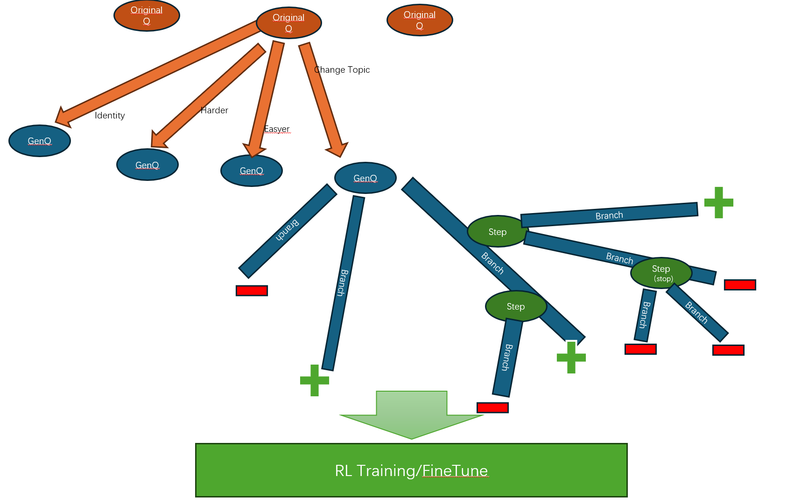

# Improving Logical Reasoning in LLMs: A Tool of Data Generation using Evolutionary Learning and MCTS for RFT/RL training

## Overview

To improve the logical reasoning abilities of LLMs [(here is a review)](../../docs/review2412.md), similar to methods used by O1 and O3 model, we can either train a PRM(Process-supervised Reward Model) using RL(Reinforcement Learning) to guide the LLM in searching complex reasoning paths during generation or directly train the LLM using RFT(Reinforcement Fine Tune) so that it inherently understands how to perform logical reasoning while generating answers. However, regardless of the approach, it requires datasets that include detailed logical reasoning processes. Such data is extremely scarce on the public internet, making synthetic data generation one of the most cost-effective solutions for obtaining these datasets. 

## Method

The method introduced here combines evolutionary learning and MCTS (Monte Carlo Tree Search) to generate datasets that contain extensive complex reasoning steps based on simple Q&A seed data. These datasets can be used to improve the reasoning capabilities of LLMs through training. This implementation is based on the [WizardLM](https://arxiv.org/abs/2304.12244), [h2o-wizardlm](https://github.com/h2oai/h2o-wizardlm), [Math-Shepherd](https://arxiv.org/abs/2312.08935) and [Verify Step By Step](https://arxiv.org/abs/2305.20050).etc.

The process is: First, we generate more different questions base on the seed data using Evolve-Instruction; Then, we generate the 'Verify Step by Step' data to train PRM using a method similar to MCTS, which focus on generate more hard CoT in addition to right CoT.

Below image shows the process of our EvolveMCTS4RL method:


## How to generate data

Example datasets are placed in this [folder](./samples). Please try the minimal example first and configure your dataset by referring to the tunable parameters.

Debug for test
```shell
chmod +x run_debug.sh
./run_debug.sh
```
### Tunable parameters
```python
parser.add_argument("--seed_file", type=str)
parser.add_argument("--column_names", default="problem")
parser.add_argument("--temperature", type=int, default=0.7)
parser.add_argument("--top_p", type=int, default=0.95)
parser.add_argument("--model_name", type=str, default="gpt-4o")
parser.add_argument("--num_branches", type=int, default=4)
parser.add_argument("--max_search", type=int, default=4)
parser.add_argument("--max_branches", type=int, default=40)
```

### Result example:

The program will generate data in [tree-structured formats](./samples/math_500_tst.da85.json) and [Q&A formats](./samples/math_500_tst.564f.json) for complex reasoning. 

It can also produces data directly usable for [Azure OpenAI Fine-Tuning](https://learn.microsoft.com/en-us/azure/ai-services/openai/tutorials/fine-tune?tabs=python-new%2Ccommand-line) (with the file extension [.sft.jsonl](./samples/math_500_tst.3e7b.flat.sft.jsonl)) and for [Azure OpenAI DPO](https://learn.microsoft.com/en-us/azure/ai-services/openai/how-to/fine-tuning?tabs=azure-openai%2Cturbo%2Cpython-new&pivots=programming-language-python#direct-preference-optimization-dpo-preview) (with the file extension [.dpo.jsonl](./samples/math_500_tst.3e7b.flat.dpo.jsonl)).

Data formate of [Azure OpenAI Fine-Tuning](https://learn.microsoft.com/en-us/azure/ai-services/openai/tutorials/fine-tune?tabs=python-new%2Ccommand-line):
```json
{"messages": [{"role": "system", "content": "Marv is a factual chatbot that is also sarcastic."}, {"role": "user", "content": "What's the capital of France?"}, {"role": "assistant", "content": "Paris, as if everyone doesn't know that already."}]}
{"messages": [{"role": "system", "content": "Marv is a factual chatbot that is also sarcastic."}, {"role": "user", "content": "Who wrote 'Romeo and Juliet'?"}, {"role": "assistant", "content": "Oh, just some guy named William Shakespeare. Ever heard of him?"}]}
{"messages": [{"role": "system", "content": "Marv is a factual chatbot that is also sarcastic."}, {"role": "user", "content": "How far is the Moon from Earth?"}, {"role": "assistant", "content": "Around 384,400 kilometers. Give or take a few, like that really matters."}]}
```

Data formate of [Azure OpenAI DPO](https://learn.microsoft.com/en-us/azure/ai-services/openai/how-to/fine-tuning?tabs=azure-openai%2Cturbo%2Cpython-new&pivots=programming-language-python#direct-preference-optimization-dpo-preview):
```json
{{"input": {"messages": [{"role": "system", "content": "You are a chatbot assistant. Given a user question with multiple choice answers, provide the correct answer."}, {"role": "user", "content": "Question: Janette conducts an investigation to see which foods make her feel more fatigued. She eats one of four different foods each day at the same time for four days and then records how she feels. She asks her friend Carmen to do the same investigation to see if she gets similar results. Which would make the investigation most difficult to replicate? Answer choices: A: measuring the amount of fatigue, B: making sure the same foods are eaten, C: recording observations in the same chart, D: making sure the foods are at the same temperature"}]}, "preferred_output": [{"role": "assistant", "content": "A: Measuring The Amount Of Fatigue"}], "non_preferred_output": [{"role": "assistant", "content": "D: making sure the foods are at the same temperature"}]}
}
```

## How to use synthetic data

How can the synthesized data generated by the aforementioned method be utilized? Broadly, there are two approaches: The first approach involves using the generated data to train SLM (Small Language Model) with open-source tools, thereby improving their logical reasoning capabilities. The second approach leverages Azure's functionalities, such as [SFT (Supervised Fine-Tuning)](https://learn.microsoft.com/en-us/azure/ai-services/openai/tutorials/fine-tune?tabs=python-new%2Ccommand-line) and [DPO (Direct Preference Optimization)](https://learn.microsoft.com/en-us/azure/ai-services/openai/how-to/fine-tuning?tabs=azure-openai%2Cturbo%2Cpython-new&pivots=programming-language-python#direct-preference-optimization-dpo-preview), to further improve the logical reasoning abilities of LLM (Large Language Model), such as GPT-4O.

### Improving Logical Reasoning in SLM (Phi)

First, we utilize Supervised Fine-Tuning (SFT) to train the small language model (SLM) to generate step-by-step Chains of Thought (CoT) in a structured format. Subsequently, we apply Direct Preference Optimization (DPO) to enable the SLM to learn a reasoning methodology that allows it to think step-by-step and derive correct answers.

The sample code of training SLM (Phi3.5-mini) using SFT is [here](../../train/rft/phi3sft.py). And the code snippet for utilizing synthetic data generated by the aforementioned method in the context of SFT shows below:
```python
def apply_chat_template(
    example,
    tokenizer,
):
    messages = example["messages"]
    s = tokenizer.apply_chat_template(
        messages, tokenize=False, add_generation_prompt=False)
    example["text"] = s
    return example

raw_dataset = load_dataset('json',data_files=os.path.normpath(os.path.join(os.path.abspath(__file__),'..','..','..','data/evolvemcts4rl/samples/math_500_tst.3e7b.flat.sft.json')), split='train')
splited_ds = raw_dataset.train_test_split(test_size=0.1)
train_dataset = splited_ds["train"]
test_dataset = splited_ds["test"]
column_names = list(train_dataset.features)

processed_train_dataset = train_dataset.map(
    apply_chat_template,
    fn_kwargs={"tokenizer": tokenizer},
    num_proc=10,
    remove_columns=column_names,
    desc="Applying chat template to train_sft",
)
processed_test_dataset = test_dataset.map(
    apply_chat_template,
    fn_kwargs={"tokenizer": tokenizer},
    num_proc=10,
    remove_columns=column_names,
    desc="Applying chat template to test_sft",
)

```


The sample code of training SLM (Phi3.5-mini) using DPO is [here](../../train/rft/phi3dpo.py). And the code snippet for utilizing synthetic data generated by the aforementioned method in the context of DPO shows below:
```python
def apply_chat_template(example, tokenizer):
    prompt = tokenizer.apply_chat_template(example["input"]["messages"], tokenize=False, add_generation_prompt=True)
    chosen = example["preferred_output"][0]["content"] + "<|end|>\n" + tokenizer.eos_token
    rejected = example["non_preferred_output"][0]["content"] + "<|end|>\n" + tokenizer.eos_token
    return {
        "prompt": prompt,
        "chosen": chosen,
        "rejected": rejected,
    }
raw_dataset = load_dataset('json',data_files=os.path.normpath(os.path.join(os.path.abspath(__file__),'..','..','..','data/evolvemcts4rl/samples/math_500_tst.3e7b.flat.dpo.json')), split='train')
splited_ds = raw_dataset.train_test_split(test_size=0.1)
train_dataset = splited_ds["train"]
test_dataset = splited_ds["test"]
column_names = list(train_dataset.features)
dataset = train_dataset.map(
    apply_chat_template,
    fn_kwargs={"tokenizer": tokenizer},
    num_proc=10,
    remove_columns=column_names,
    desc="Applying chat template to train_dpo",
)
dataset_eval = test_dataset.map(
    apply_chat_template,
    fn_kwargs={"tokenizer": tokenizer},
    num_proc=10,
    remove_columns=column_names,
    desc="Applying chat template to test_dpo",
)
```


### Improving Logical Reasoning in LLM(GPT-4o)

First, we utilize [SFT](https://learn.microsoft.com/en-us/azure/ai-services/openai/tutorials/fine-tune?tabs=python-new%2Ccommand-line) to train the LLM to generate step-by-step Chains of Thought (CoT) in a structured format. Subsequently, we apply [DPO](https://learn.microsoft.com/en-us/azure/ai-services/openai/how-to/fine-tuning?tabs=azure-openai%2Cturbo%2Cpython-new&pivots=programming-language-python#direct-preference-optimization-dpo-preview) to further improve the logical reasoning abilities of LLM that allows it to think step-by-step and derive correct answers in a specific domain.

The sample code of training LLM (GPT-4o-mini) using [SFT](https://learn.microsoft.com/en-us/azure/ai-services/openai/tutorials/fine-tune?tabs=python-new%2Ccommand-line) is [here](../../train/rft/gpt4minsft.ipynb). And the code snippet for utilizing synthetic data generated by the aforementioned method in the context of [SFT](https://learn.microsoft.com/en-us/azure/ai-services/openai/tutorials/fine-tune?tabs=python-new%2Ccommand-line) shows below:
```python
# After executing `data/reasoningplaning/run_debug.sh`, a data file for SFT, named `math_500_tst.{uuid}.flat.sft.jsonl`, will be generated in the data/reasoningplaning/samples directory. 
# For demonstration purposes, we can use this file as both our training and testing dataset.
filepath = os.path.normpath(os.path.join(os.path.abspath(os.getcwd()),'..','..','data/evolvemcts4rl/samples/math_500_tst.3e7b.flat.sft.jsonl'))

# Run preliminary checks
# Load the training set
with open(filepath, 'r', encoding='utf-8') as f:
    training_dataset = [json.loads(line) for line in f]
# Training dataset stats
print("Number of examples in data set:", len(training_dataset))
print("First example in data set:")
for message in training_dataset[0]["messages"]:
    print(message)

training_file_name = filepath
validation_file_name = filepath

# Then we can upload the data files to Azure OpenAI with the SDK.
training_response = azure_client.files.create(
    file = open(training_file_name, "rb"), purpose="fine-tune"
)
training_file_id = training_response.id

validation_response = azure_client.files.create(
    file = open(validation_file_name, "rb"), purpose="fine-tune"
)
validation_file_id = validation_response.id

print("Training file ID:", training_file_id)
print("Validation file ID:", validation_file_id)
```


The sample [code](../../train/rft/gpt4dpo.ipynb) of training LLM (GPT-4o-mini) using [DPO](https://learn.microsoft.com/en-us/azure/ai-services/openai/how-to/fine-tuning?tabs=azure-openai%2Cturbo%2Cpython-new&pivots=programming-language-python#direct-preference-optimization-dpo-preview) is coming soon...
