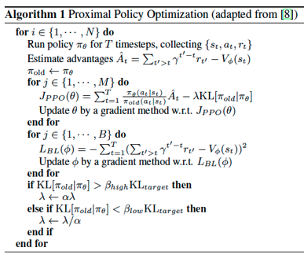
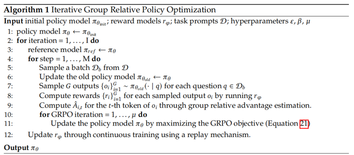

# Reproduce Deepseek R1-zero Aha Moment

## The Code
We used the method of `accelerate` + `deepspeed` + `transformers` + `trl.GRPOTrainer`. Do not use `unsloth` acceleration because it does not yet support distributed training.  
   
For faster experimental speed, I used the 0.5B and 1.5B versions of Qwen2.5.  
   
The code to config the `deepspeed` backend in `accelerate` is in `train/r1/phi4grpo_zero2.yaml` (yes, the `deepspeed` configuration file is the same as when using `phi4`). Note that the number of `num_processes` should be set to the number of GPUs specified in the `CUDA_VISIBLE_DEVICES` environment variable minus one, because one GPU needs to be reserved for `vllm` to generate the `group relative policy`. Some configuration is as follows:  
```yaml
......
distributed_type: DEEPSPEED
downcast_bf16: 'no'
machine_rank: 0
main_training_function: main
mixed_precision: bf16
num_machines: 1
num_processes: 2
......
```
The code that calls `GRPOTrainer` is `train/r1/Less7BGrpo.py`, and the reward functions and some code snippets are shown follows:  
```python
......
SYSTEM_PROMPT = (
    "A conversation between User and Assistant. The user asks a question, and the Assistant solves it. The assistant "
    "first thinks about the reasoning process in the mind and then provides the user with the answer. The reasoning "
    "process and answer are enclosed within <think> </think> and <answer> </answer> tags, respectively, i.e., "
    "<think> reasoning process here </think><answer> answer here </answer>"
)

"""奖励函数. 通过与ground truth的对比来检查LLM给出的答案是否正确"""
def accuracy_reward(completions, solution, **kwargs):
......
"""奖励函数. 检查LLM生成的格式是否符合我们的要求"""
def format_reward(completions, **kwargs):
......
trainer = PrintResultGRPOTrainer(
    model=model_args.model_name_or_path,
    reward_funcs=reward_funcs,
    args=training_args,
    train_dataset=dataset[script_args.dataset_train_split],
    eval_dataset=dataset[script_args.dataset_test_split] if training_args.eval_strategy != "no" else None,
    peft_config=get_peft_config(model_args),
)
......
```
   
`Less7BGrpo.py` is invoked by `train/r1/less7grpo.sh`. Some code snippets are as follows:  
```shell
accelerate launch --config_file phi4grpo_zero2.yaml --num_processes=1 Less7BGrpo.py --config qwn0.5b_trl.yaml
```
The code snippets for configuring `GRPOTrainer` are as follows. We used `vllm` to generate the group policy and performed full-parameter fine-tuning without using `peft`.
```yaml
......
use_vllm: true
vllm_device: auto
vllm_gpu_memory_utilization: 0.7
......
lr_scheduler_type: cosine
learning_rate: 3.0e-06
max_prompt_length: 256
num_generations: 16
max_completion_length: 1024
......
```

## Tuning and Enhancing the GRPO
The PPO optimization algorithms:


The GRPO optimization algorithms:


Comparing the PPO and GRPO optimization algorithms. GRPO essentially removes the value function model \( V \). The purpose of \( V \) is to predict the expected cumulative reward based on historical rewards and the current state as input, serving as a baseline for reward training. This allows the model to learn step by step to achieve higher rewards. In contrast, GRPO posits that in the context of LLMs, using the average reward of the `group relative policy` can also serve as a baseline to encourage the model to continuously improve rewards during training.  
   
Those who have previously used self-supervised learning will recognize that the larger the \( G \), the better. And based on prior experience with PPO, the parameter \( β \) needs to be continuously adjusted during training. In fact, the `GRPOTrainer` only exposes these two hyperparameters for tuning the GRPO optimization algorithm.  
   
To enhance the `GRPOTrainer` so that we can print the results of each `group relative policy` during training, we modified the `compute_loss` function of `GRPOTrainer`.
```python
......
class PrintResultGRPOTrainer(GRPOTrainer):
    def compute_loss(self, model, inputs, return_outputs=False, num_items_in_batch=None):
......
        prompt_inputs = super()._prepare_inputs(prompt_inputs)
        if prompt_inputs["input_ids"].device != device:
            prompt_inputs["input_ids"] = prompt_inputs["input_ids"].to(device)
            prompt_inputs["attention_mask"] = prompt_inputs["attention_mask"].to(device)
......
        completion_ids = prompt_completion_ids[:, prompt_length:]
        if self.accelerator.is_main_process and not self.args.use_vllm:
            batchOutputs = self.processing_class.batch_decode(completion_ids, skip_special_tokens=True)
            qidx = 0
            prmp = ''
            for i, generated_text in enumerate(batchOutputs):
                if i % self.num_generations == 0:
                    print('-'*100)
                    print('\n\n\n')
                    prmp = prompts[qidx][-1]['content']
                    print("[[ORIGINAL Q]]: ", prmp )
                    qidx = qidx + 1
                print('='*100)
                print("【USER】: ", prmp )
                print("\n[ASSISTANT]:", generated_text)
......
```

## Aha Moment
Regarding the reflection and "Aha moment", the Qwen 0.5B model occasionally exhibited them after training on about 300 samples, while the Qwen 1.5B model occasionally exhibited them after training on approximately 100 samples. The reflection ability appeared earlier than the "Aha moment" ability.  
   
Furthermore, whether it was Qwen 0.5B or Qwen 1.5B, when the reward reached around 0.05—that is, when the model was correctly answering about 5 out of 100 questions—these reflection and "Aha moment" abilities would occasionally emerge.  
   
The responses from the models when these reflection and "Aha moment" abilities appeared are as follows.

The reflection:
```log
【USER】: ......Let \[f(n) =
\begin{cases}
n^2-1 & \text{ if }n < 4,
\\ 3n-2 & \text{ if }n \geq 4.
\end{cases}
\]Find $f(f(f(2)))$.
......
【ASSISTANT】: I understand the given code. To find $f(f(f(2)))$, we first need to evaluate $f(2)$, and then use that result to evaluate $f(f(2))$ and $f(f(f(2)))$ successively.
......
$f(7) = 3(7) - 2 = 21 - 2 = 19$,

but wait! This is incorrect.

In fact, we have $f(n) = n^2 - 1$ for $n < 4$, so we need to use this definition, and substitute $7$ for $n$:
```
The "Aha moment":
```log
【USER】: ......
The graphs of two functions, $p(x)$ and $q(x),$ are shown here on one set of axes: [asy]
......
【ASSISTANT】: <p class="r">The graph of $p(x)$ is a horizontal line, and the graph of $q(x)$ is an exponential curve that passes through ......
......
Aha, this is true. If $p(x) = x$, then the answer is <span class="r">4.000000</span>.</p>
......
```

## From the Perspective of Eval Metrics.
By default, `trl` saves metrics in TensorBoard format. We can open TensorBoard to view them using the following command:  
```shell
tensorboard --logdir .
```
The figure below illustrates the change in reward during the training process. We can observe that the 0.5B model improves very slowly when the reward is around 0.4, approaching saturation. In contrast, the 1.5B model approaches saturation when the reward is around 0.7, and it reaches saturation much earlier than the 0.5B model.

Reward of 0.5B model:

Reward of 1.5B model:


The figure below shows the change in `reward_std` during training. We can see that the `reward_std` of the 0.5B model keeps increasing, indicating that although the model gets some questions correct as the number of training steps increases, it cannot consistently do so. The `reward_std` of the 1.5B model gradually decreases, demonstrating that it is getting more and more questions right and can consistently provide correct answers.

Reward_std of 0.5B model:

Reward_std of 1.5B model:
