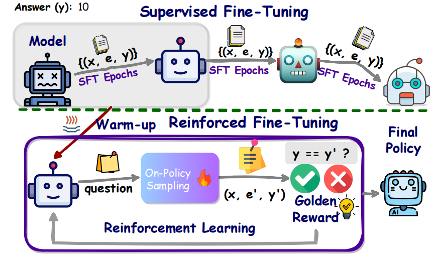
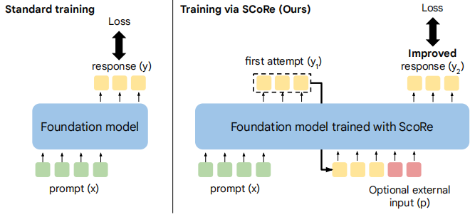
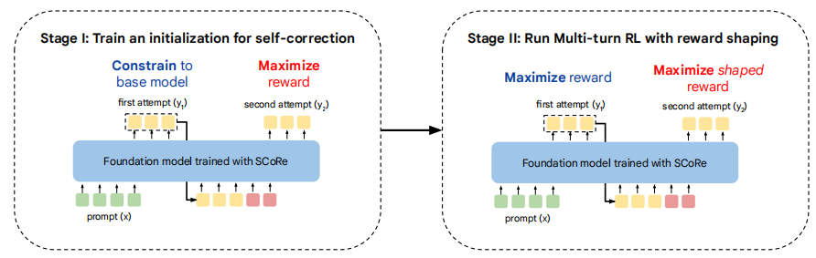
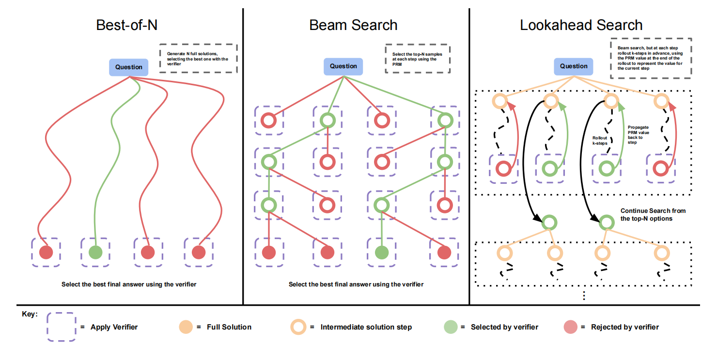

# Approaches to Improve Logical Reasoning in LLMs: Some Techniques Behind O3

The emergence of O1 and O3 models has sparked significant interest in improving the reasoning capabilities of LLMs, as researchers and organizations aim to ensure their large models can match, or at least not fall too far behind, the logical reasoning performance of O3. A general consensus has formed around the relevant techniques, which may include: Post Training, PRM (Process-supervised Reward Model), ORM (Outcome-supervised Reward Model), CoT (Chain of Thought), RFT (Reinforcement Fine-Tuning), Test/Inference Time Scaling, RL (Reinforcement Learning), and MCTS (Monte Carlo Tree Search).   
  
This article categorizes methods for applying these techniques to improve the logical reasoning capabilities of large models into three approaches, ranked by increasing cost: (1) "one-shot generation of a long CoT and the final answer," (2) "serial attempts at multiple CoTs based on self-reflection and error correction, followed by outputting the final answer," and (3) "parallel searches across multiple CoTs, selecting a promising set of final answers (with each branch potentially incorporating the first two approaches)."   
  
Below, we will briefly describe how these three categories of approaches apply the aforementioned techniques to improve the reasoning capabilities of large models.

## 1. One-shot Generation of a Long CoT and Final Answer  
   
This approach internalizes the ability to reason step-by-step (CoT, Chain of Thought) within the LLM itself through SFT or RL, allowing the LLM to independently think through and generate CoT step-by-step and eventually output the inferred answer, even without explicit prompt guidance. Examples of this approach include ReFT and STILL-2.  

   
**Data Preparation:**    
This approach synthesizes CoT-augmented data using other LLMs. ReFT employs a relatively straightforward and crude method with minimal details—using GPT-3.5 to generate CoT-augmented data based on QA pairs. In contrast, STILL-2 invests significantly more effort in data synthesis, employing special tokens, performing prompt tuning, and utilizing models with stronger logical reasoning capabilities to generate data. The goal is to produce more challenging, longer, and higher-quality CoT data.  
   
**Post Training:**    
Both ReFT and STILL-2, as well as papers using the other two approaches described later, begin by performing an initial SFT step to train the model to output results in a specific CoT format. Afterward, the model is further trained with RL algorithms (i.e., RFT) to enhance its ability to arrive at correct answers through logical reasoning. At this stage, ReFT uses PPO (without training a reward model, instead relying on a simple reward function), whereas STILL-2 uses DPO. Due to the more meticulous data processing in STILL-2, its results surpass those of ReFT.  
   
**Test/Inference Time Scaling:**    
The "one-shot generation of a long CoT and final answer" approach does not involve complex RL or tree search algorithms during the inference phase. Instead, it outputs results directly, as in normal LLM inference, or samples multiple outputs and selects the best answer based on certain criteria, such as the most frequent output, the lowest perplexity, etc. This latter strategy can already be considered a form of scaling during the test/inference phase.

## 2. Serial Attempts at Multiple CoTs Based on Self-Reflection and Error Correction, Followed by Outputting the Final Answer  
   
This approach not only internalizes the ability to reason step-by-step (CoT) within the LLM but also incorporates the capability to reflect on and correct earlier reasoning at certain stages of the thought process. An example of this approach is SCoRe. Researchers argue that self-reflection and correction based purely on prompts or multi-agent frameworks may sometimes fail to perform effective self-correction, especially when the correct reasoning path diverges significantly from the initial attempt. To address this limitation, the two-stage training method proposed by SCoRe was introduced.  

   
**Data Preparation:**    
SCoRe generates self-correction training data in two rounds using an LLM. In this data, the reasoning in the first round is incorrect, while the reasoning in the second round is corrected and accurate. However, the paper does not provide detailed explanations on how the data is generated or how its quality is ensured.  
   
**Post Training:**    
SCoRe employs a two-stage alternating training process:    

- **Stage 1:** Rewards are provided only for the corrected results in the second attempt. Additionally, KL divergence is used to prevent the model parameters from changing excessively, which could destabilize training.    
- **Stage 2:** Rewards are given for both the first attempt and the corrected second attempt. This is done to prevent the model from intentionally generating poor results in the first attempt during training.  
   
**Test/Inference Time Scaling:**    
Since this approach does not train an additional reward model (RM), the inference method is similar to that used in the "one-shot generation of a long CoT and final answer" approach. Specifically, the model outputs results directly or samples multiple outputs, selecting the best answer based on certain criteria (e.g., frequency, perplexity, etc.).

## 3. Parallel Search Across Multiple CoTs to Identify Promising Final Outputs (Each Branch Can Incorporate the Previous Two Approaches)  
   
When humans deeply analyze a complex problem, they rarely follow a single line of reasoning to its conclusion without exploring alternatives. Instead, they attempt different approaches, focusing on a few promising ones, and progressively narrowing the scope of their reasoning as they delve deeper. Inspired by this, researchers have proposed similar methods to improve the logical reasoning capabilities of LLMs. In addition to allocating significant computational resources to search during inference, a key distinction of this approach is the training of a verifier to evaluate whether each step of the CoT generated by the LLM is meaningful. This verifier can be a PRM (Process-supervised Reward Model) or an ORM (Outcome-supervised Reward Model). The idea was first introduced by OpenAI in "Let’s Verify Step by Step" and further developed by DeepMind in "Scaling LLM Test-Time Compute Optimally Can Be More Effective than Scaling Model Parameters."  
   
Given the unique nature of this strategy, which integrates various search algorithms during inference, we will first explain the “Test/Inference Time Scaling” aspect for clarity.  
   
### Test/Inference Time Scaling    
Building on OpenAI's work, DeepMind researchers proposed three classic search strategies for test/inference time scaling, as illustrated in the referenced diagram. Of course, there are other, potentially more complex or effective search methods for inference, but this discussion will focus on the three classic approaches, explained from left to right in the diagram. All these methods are guided by a trained verifier, which essentially acts as a reward model (RM) to score intermediate results and help select better search branches.  

   
1. **Best of N:**    
   For a given problem, the model generates N samples (where a single sample = steps + answer). These samples are passed through the verifier, which scores their intermediate steps as a whole. Common scoring strategies include taking the minimum score across all steps as the overall score or using the score of the final step as the overall score. The sample with the highest overall score (steps + answer) is selected as the output.  
   
2. **Beam Search:**    
   For a given problem, the model first generates N parallel step-1s (e.g., N = 4 in the diagram). Each "problem + step-1" is sent to the verifier to obtain a score for step-1. The top M step-1s with the highest scores are selected, and for each of these, the model generates N step-2s. The process is repeated (evaluating step-2 by passing "problem + step-1 + step-2" to the verifier) until a predefined stopping condition is met.  
   
3. **Lookahead Search:**    
   For a given problem, the model first generates N parallel step-1s (e.g., N = 4 in the diagram). However, instead of immediately scoring these step-1s using the verifier, each step-1 is allowed to continue generating K subsequent steps. The final steps in these sequences are then evaluated by the verifier, and the top M results with the highest scores are selected, with their corresponding step-1s returned as the final candidates. These selected step-1s then serve as starting points for further iterations, and the process is repeated until the stopping condition is met.  
   
### Data Preparation    
Rigorous CoTs for complex problems are difficult to obtain from publicly available datasets, so well-funded companies often invest significant resources in manually creating such data. However, synthesizing data using different LLMs is a more practical option for broader accessibility. For instance, the STAR method synthesizes and selects CoT data using LLMs, and can also employ LLMs to correct CoTs that produce incorrect answers. Methods like RAP and rSTAR combine evolutionary learning, reinforcement learning, and MCTS (Monte Carlo Tree Search) to iteratively generate diverse CoTs and use unsupervised methods to annotate and filter the generated CoTs.  

### Post Training    
Since this approach requires a verifier to guide the inference process, training the verifier is an essential step. The verifier itself is a reward model (PRM or ORM), which necessitates the use of the PPO algorithm for training, as DPO (which bypasses the need for an RM) cannot be applied in this case. The general training process is as follows:    
  
1. **Training the Generator:**    
   First, the generator (typically an LLM) is trained using SFT to produce CoTs in a specific format, ensuring that individual steps and transitions between steps are clearly distinguishable.  
   
2. **Training the Verifier:**    
   The verifier (typically an LLM acting as an RM) is trained in a manner similar to training a classifier. It is tasked with scoring each step generated by the generator.  
   
3. **Fine-Tuning the Generator with PPO:**    
   Finally, the generator (LLM) is fine-tuned using PPO and the verifier. The goal is to ensure that each reasoning step in the CoT generated by the LLM can, under the guidance of the verifier, effectively lead to the correct answer.

## Reference

- Let's Verify Step by Step
- Scaling LLM Test-Time Compute Optimally can be More Effective than Scaling Model Parameters
- REFT: Reasoning with REinforced Fine-Tuning
- SCoRe Training Language Models to Self-Correct via Reinforcement Learning
- Mutual Reasoning Makes Smaller LLMs Stronger Problem-Solvers
- A Theoretical Understanding of Self-Correction through In-context Alignment
- Self-Taught Reasoner Bootstrapping Reasoning With Reasoning
- Scalable Online Planning via Reinforcement Learning Fine-Tuning
- [Azure OpenAI GPT-4o-mini fine-tuning tutorial](https://learn.microsoft.com/en-us/azure/ai-services/openai/tutorials/fine-tune?tabs=python-new%2Ccommand-line)
- [Customize a model with fine-tuning and DPO(Direct preference optimization)](https://learn.microsoft.com/en-us/azure/ai-services/openai/how-to/fine-tuning?tabs=azure-openai%2Cturbo%2Cpython-new&pivots=programming-language-python)
- [Azure DPO(Direct preference optimization)](https://learn.microsoft.com/en-us/azure/ai-services/openai/how-to/fine-tuning?tabs=azure-openai%2Cturbo%2Cpython-new&pivots=programming-language-python#direct-preference-optimization-dpo-preview)
- [Approaches to Improve Logical Reasoning in LLMs: The Techniques Behind the O3](https://github.com/butterluo/ImproveReasoning/blob/main/docs/review2412.md)
- [Improving Logical Reasoning in LLMs: A Tool of Synthetic Data Generation using Evolutionary Learning and MCTS](https://github.com/butterluo/ImproveReasoning/blob/main/data/evolvemcts4rl/README.md)
